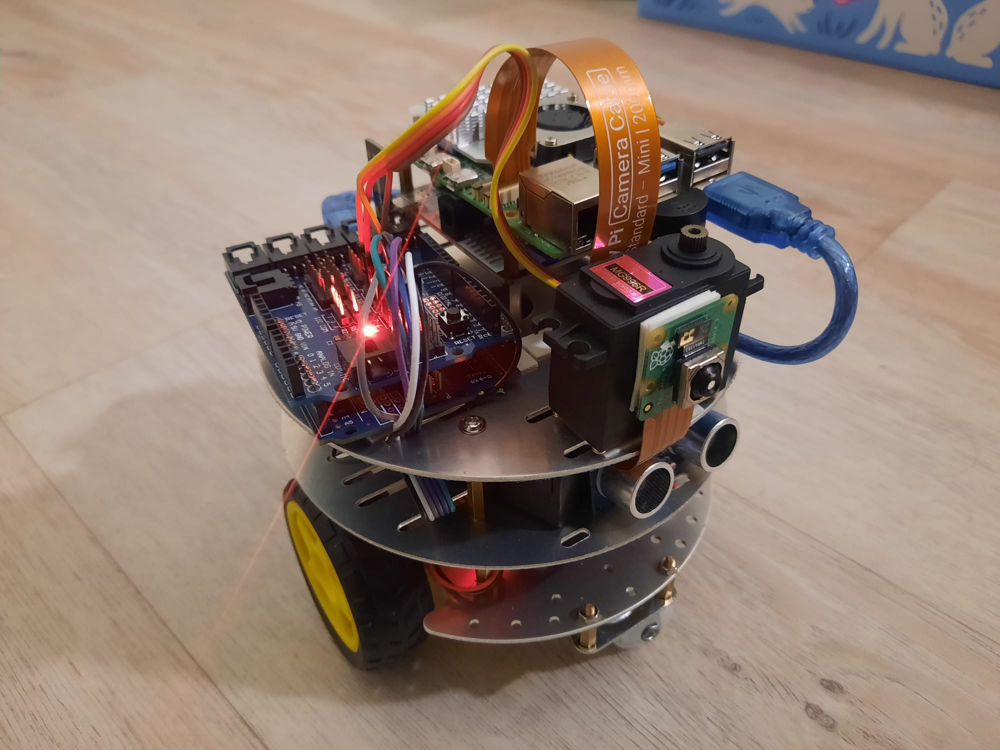
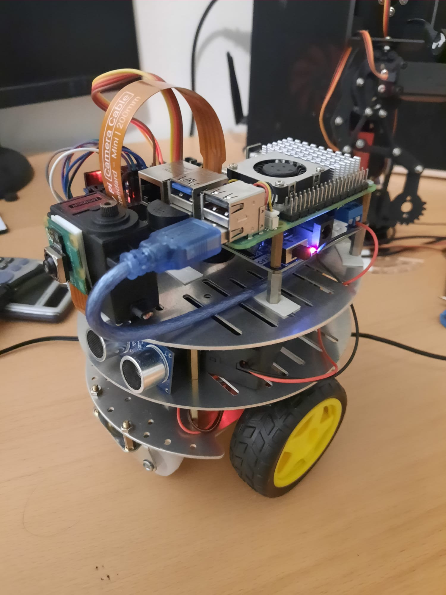

# ROS2 Patrol Robot



The **ROS2 Patrol Robot** is a smart patrolling ground vehicle that keeps moving in a predefined path and uses an ultrasonic sensor to detect nearby obstacles. Upon detection, it halts movement, captures an image using a Raspberry Pi Camera, and sends that image to a Flask server for logging. This project uses ROS2 for inter-process communication, an Arduino for sensor control, and an L298N motor driver for driving the motors.

---

## Note
Both the raspberry pi robot and the Machine running the Flask server need to be connected to the WIFI network.

## Features

- Obstacle detection using ultrasonic sensor (HC-SR04)
- Motor control using L298N motor driver
- Image capture with Raspberry Pi Camera using libcamera
- ROS2 nodes for data publishing and event handling
- Flask backend to store images
- Easy one-command shell script to launch the whole system

---

## Required Hardware

- Raspberry Pi (tested with Raspberry Pi 5, 64-bit OS)
- Raspberry pi UPS HAT
- Arduino Uno
- HC-SR04 Ultrasonic Sensor
- L298N Motor Driver
- Raspberry Pi v3 Camera Module
- 2x DC Motors
- External battery pack
- USB cable (Arduino to Raspberry Pi)
- Jumper wires
- Robot chasis with wheels

---

## Wiring and Connections

### Ultrasonic Sensor (HC-SR04) → Arduino:
- VCC → 5V
- GND → GND
- TRIG → Pin 9
- ECHO → Pin 10

### L298N Motor Driver:
- IN1, IN2 → Arduino pins (for motor A)
- IN3, IN4 → Arduino pins (for motor B)
- IN1, IN2, IN3, IN4 to PIN 7, 2, 4, 3
- 7.4V → Motor power supply
- GND → Common ground with Arduino and Pi
- OUT1, OUT2 → Motor A
- OUT3, OUT4 → Motor B

### Arduino to Raspberry Pi:
- Connect via USB. This allows the Pi to receive serial data from the Arduino.

---

## Arduino Setup

1. Open the Arduino IDE.
2. Connect your Arduino via USB.
3. Select the correct board and port.
4. Paste and upload your ultrasonic sensor and motor control sketch.
5. Once uploaded, disconnect and reconnect the Arduino to the Raspberry Pi.

---

## Raspberry Pi Setup

### 1. Clone this Repository

```bash
mkdir -p ~/patrol_robot_ws/src
cd ~/patrol_robot_ws/src
git clone https://github.com/yourusername/patrol_system.git
```

### 2. Build the ROS2 Workspace

```bash
source /opt/ros/jazzy/setup.bash
cd ~/patrol_robot_ws
ros2 pkg create --build-type ament_python patrol_system --dependencies rclpy std-msgs
colcon build
```


```bash
source install/setup.bash
```

### 3. Test Raspberry Pi Camera

```bash
libcamera-still -o test.jpg
```

## Running the Patrol Robot

To run the full ROS2 system with all nodes, use the included shell script start_robot.sh.

**start_robot.sh** (included):

```bash
#!/bin/bash

cd ~/patrol_robot_ws
source /opt/ros/jazzy/setup.bash
colcon build
source install/setup.bash
ros2 launch patrol_system patrol_launch.py
```

Make it executable and run:

```bash
chmod +x run_patrol_robot.sh
./run_patrol_robot.sh
```

This script will:

- Build the ROS2 workspace
- Source the ROS environment
- Launch both `ultrasonic_publisher` and `camera_monitor` nodes via a launch file

## Flask Backend Setup

Run this Flask server on a separate machine (laptop or another Pi on the same network).

1. Install Flask:

```bash
pip install flask
```

2. Create and run the server:

```bash
python server.py
```

The server will:

- Accept images from the Raspberry Pi robot
- Save them in the `received_images` folder
- Print “Obstacle Detected” upon each image upload

Make sure the IP of the server matches what’s used in the `camera_monitor.py` node (e.g., `http://192.168.0.16:5000/upload`).

## Required Setups Before Launching

- Enable the Pi Camera using `sudo raspi-config`.
- Ensure `/dev/ttyUSB0` is available and connected to Arduino.
- Both Raspberry Pi and the Flask server should be on the same network.
- Upload the correct sketch to Arduino.
- Plug in motors to the L298N driver correctly.
- Run the Flask server before starting the robot.
- Use the `run_patrol_robot.sh` script to launch the ROS2 system.

## How It Works

- Arduino continuously measures distance using the HC-SR04 ultrasonic sensor and sends the data via serial.
- The `ultrasonic_publisher` node (on Raspberry Pi) reads the serial data and publishes it to a ROS2 topic.
- The `camera_monitor` node subscribes to that topic:
  - If the obstacle is closer than the threshold (e.g., 40 cm), it sends a STOP command to Arduino.
  - Captures an image using `libcamera-still`.
  - Sends the image to the Flask backend server.
- Once the path is clear, it sends a RESUME command.
- The Flask backend saves each image and logs the detection event.

## Robot Image


